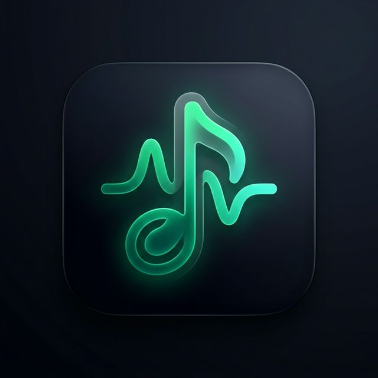

<div align="center">
  
  <h1>SONG ME</h1>
  <p><b>The ultimate multiplayer music guessing game!</b></p>
</div>

## 🎵 What is SONG ME?

**SONG ME** is an interactive, multiplayer music party game to play with friends! In this game, players join a lobby and each person anonymously adds their favorite songs from YouTube to the shared room playlist. 

Once the game starts, the songs are played one by one. Your goal? **Guess who added the current track!** Vote correctly to earn points and climb the leaderboard to prove you know your friends' music tastes best.

### Features
- 🎮 **Real-time Multiplayer:** Play with your friends in synchronized live rooms.
- 🔍 **Integrated YouTube Search:** Find and add songs effortlessly without leaving the game.
- 🤫 **Anonymous Playback:** Songs are revealed only after voting ends.
- 🏆 **Leaderboards & Scoring:** Correct guesses earn you points.

---

## 🚀 How to Run Locally

Follow these steps to get the app running on your machine:

### 1. Prerequisites
- **Node.js**: Make sure you have Node.js installed on your system.
- **API Keys**: You will need a YouTube Data API v3 key to enable the song search feature.

### 2. Installation
Clone the repository and install the dependencies:
```bash
npm install
```

### 3. Environment Variables
Create a file named `.env.local` in the root folder of the project. You must configure the following keys:

```ini
# Required for searching tracks inside the app:
YOUTUBE_API_KEY="your_youtube_data_v3_api_key_here"

# If using Gemini AI features:
GEMINI_API_KEY="your_gemini_api_key_here"
```

### 4. Start the Application
Start the development server:
```bash
npm run dev
```

The app will start on `http://localhost:3000`. Open this URL in your browser to start playing!

---

## 🛠 Tech Stack
- **Frontend**: React 19, Vite, Tailwind CSS, Motion (Animations), Lucide React (Icons).
- **Backend & Real-time Database**: Firebase (Firestore, Auth), Express Server for API handling.
